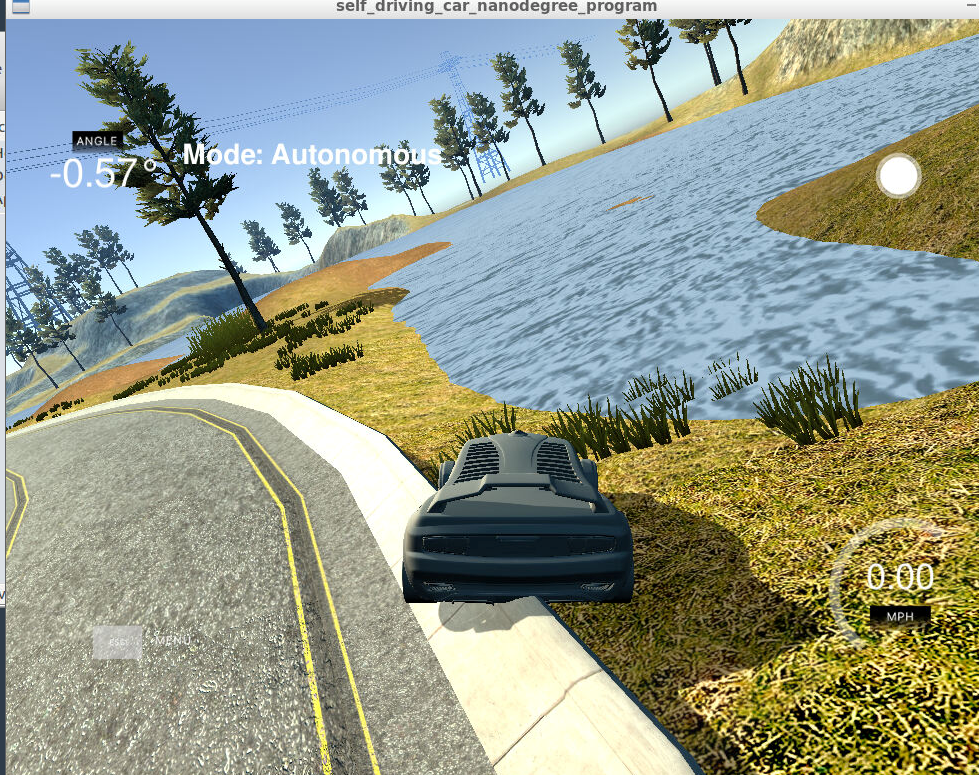
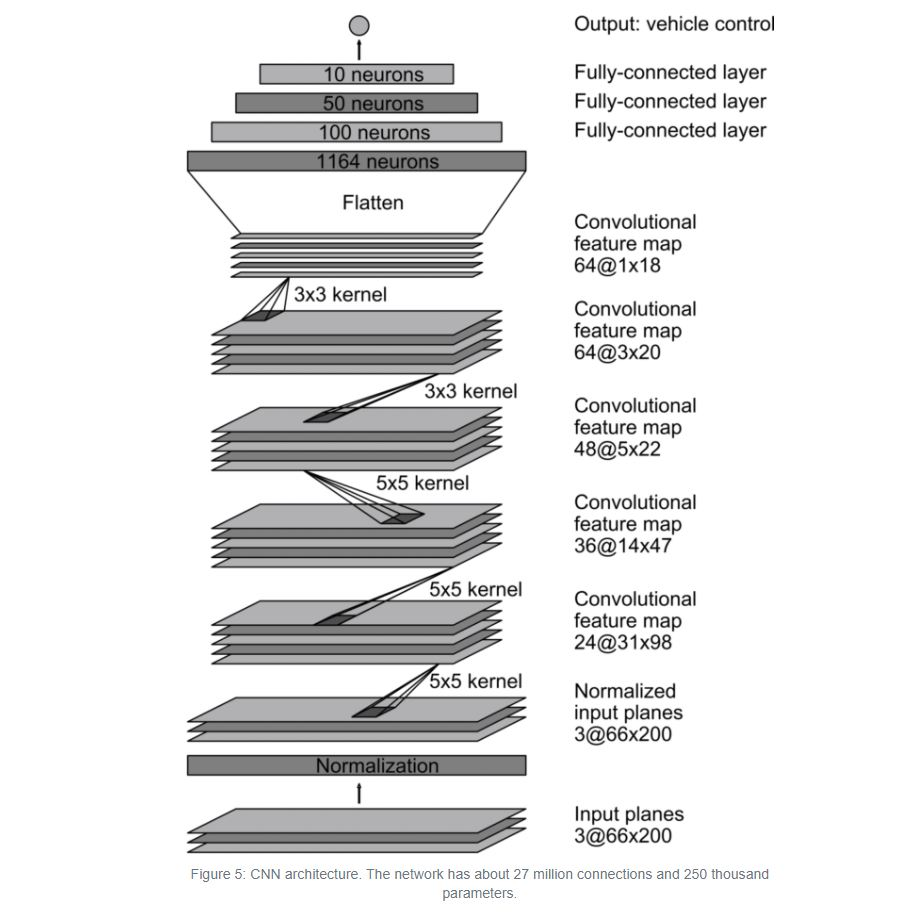
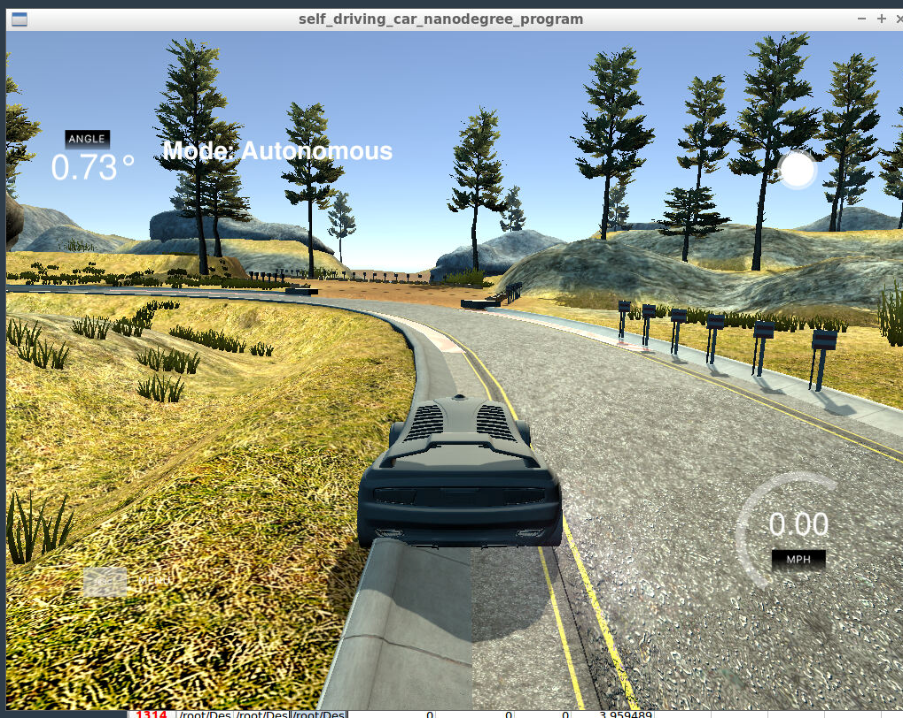
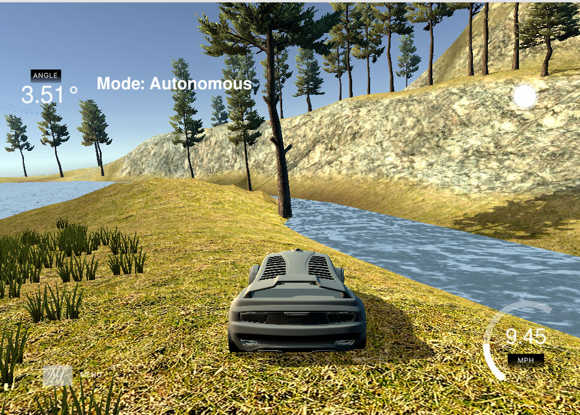
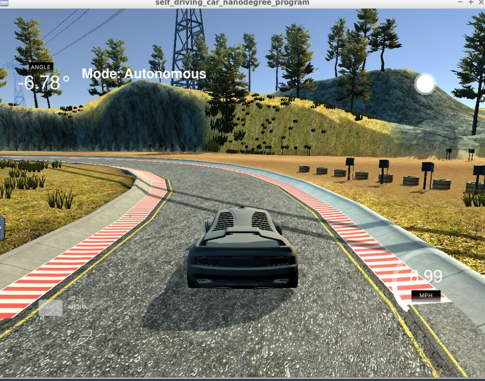
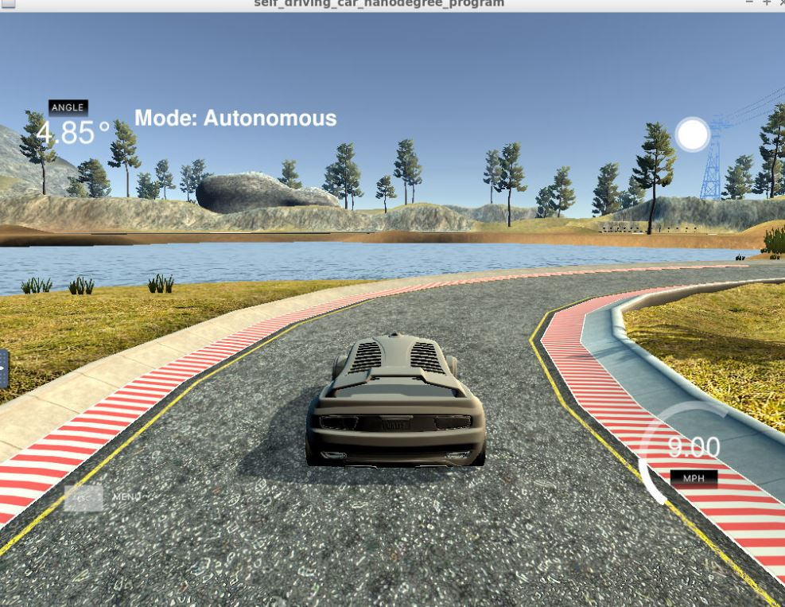

# **Behavioral Cloning** 

## Writeup Template


**Behavioral Cloning Project**

The goals / steps of this project are the following:
* Use the simulator to collect data of good driving behavior
* Build, a convolution neural network in Keras that predicts steering angles from images
* Train and validate the model with a training and validation set
* Test that the model successfully drives around track one without leaving the road
* Summarize the results with a written report


## Rubric Points
### Here I will consider the [rubric points](https://review.udacity.com/#!/rubrics/432/view) individually and describe how I addressed each point in my implementation.  

---
### Files Submitted & Code Quality

#### 1. Submission includes all required files and can be used to run the simulator in autonomous mode

My project includes the following files:
* model.py containing the script to create and train the model
* drive.py for driving the car in autonomous mode
* model_nvidia_with_allcams_2.h5 containing a trained convolution neural network 
* writeup_report.md or writeup_report.pdf summarizing the results

#### 2. Submission includes functional code
Using the Udacity provided simulator and my drive.py file, the car can be driven autonomously around the track by executing 
```sh
python drive.py model_nvidia_with_allcams_2.h5
```

#### 3. Submission code is usable and readable

The model.py file contains the code for training and saving the convolution neural network. The file shows the pipeline I used for training and validating the model, and it contains comments to explain how the code works.

### Model Architecture and Training Strategy

#### 1. An appropriate model architecture has been employed

Two models, Regression Model as well as more complex model(Nvidia's end-to-end deep learning model for self driving cars) were implemented. The final model chosen based on the accuracy was Nvidia's model, as it could drive the vehicle successfully for one complete lap


#### 2. Attempts to reduce overfitting in the model

The model was trained and validated on different data sets to ensure that the model was not overfitting (code line 22 - 45). The model was tested by running it through the simulator and ensuring that the vehicle could stay on the track.

Each time, the number of epochs were adjusted such that the training loss and the validation loss monotonically decreased each epoch. The final choice for the number of 
epochs was 5 epochs. 

#### 3. Model parameter tuning

The model used an adam optimizer, so the learning rate was not tuned manually (model.py line 130).

#### 4. Appropriate training data

Training data was chosen to keep the vehicle driving on the road. I initially used the example data already provided by the Udacity. Also, I only used center images to begin with. 

For details about how I created the training data, see the next section. 

### Model Architecture and Training Strategy

#### 1. Solution Design Approach

The initial approach I used was regression, without any convolutional layers just to check how the model performs. In this approach, any kind of preprocessing was not used. 

in model.py(line 106 - 114) this model is described. The model had poor validation accuracy, although good training accuracy with a validation split of 20%. 

The implemented regression model is the following

-----------------------------------------------------------------
Layer (type)          |       Output Shape              Param    
----------------------|-------------------------------------------
----------------------|-------------------------------------------
lambda_1 (Lambda)     |       (None, 160, 320, 3)       0         
----------------------|-------------------------------------------
flatten_1 (Flatten)   |       (None, 153600)            0         
----------------------|-------------------------------------------
dense_1 (Dense)       |       (None, 1)                 153601    
----------------------|-------------------------------------------

With this model however, the vehicle only drove barely for a few meters. It failed to steer on sharp turns. Example image with this model:

<p>
    
</p>


#### 2. Final Model Architecture

My final model consists of a Convolutional Neural Network originally developed by Nvidia. In brief, the model consists of 5 convolutional layers followed 
by 3 fully connected layers. The convolutional layers are of filter sizes 24, 36, 48, 64, 64 respectively, with a kernel size of 5x5. This is defined in model.py 
lines(119-123). Then 3 fully connected layers are added. 

Before this preprocessing of images is done for better learning.

The model also included RELU activations that introduces non linearity. The model exactly replicates the following design initially proposed by Nvidia. 

<p>
    
</p>

The model summary of the Nvidia model is given below:

-------------------------------------------------------------------
Layer (type)              |   Output Shape          |    Param   
--------------------------|-------------------------|---------------
lambda_1 (Lambda)         |   (None, 160, 320, 3)   |    0         
--------------------------|-------------------------|--------------
cropping2d_1 (Cropping2D) |   (None, 65, 320, 3)    |    0         
--------------------------|-------------------------|--------------
conv2d_1 (Conv2D)         |   (None, 33, 160, 24)   |    1824      
--------------------------|-------------------------|--------------
conv2d_2 (Conv2D)         |   (None, 17, 80, 36)    |    21636     
--------------------------|-------------------------|--------------
conv2d_3 (Conv2D)         |   (None, 9, 40, 48)     |    43248     
--------------------------|-------------------------|--------------
conv2d_4 (Conv2D)         |   (None, 9, 40, 64)     |    27712     
--------------------------|-------------------------|--------------
conv2d_5 (Conv2D)         |   (None, 9, 40, 64)     |    36928     
--------------------------|-------------------------|--------------
flatten_1 (Flatten)       |   (None, 23040)         |    0         
--------------------------|-------------------------|--------------
dense_1 (Dense)           |   (None, 100)           |    2304100   
--------------------------|-------------------------|--------------
dense_2 (Dense)           |   (None, 50)            |    5050      
--------------------------|-------------------------|--------------
dense_3 (Dense)           |   (None, 10)            |    510       
--------------------------|-------------------------|--------------
dense_4 (Dense)           |   (None, 1)             |    11        
--------------------------|-------------------------|--------------

#### 3. Creation of the Training Set & Training Process

To capture good driving behavior, I started with the center images given by Udacity. No new training data was recorded. The behaviour was OK for straight road scenarios. However, the vehicle did not successfully drive around the corners. Sometimes it crashed into the borders. 

<p>
    
</p>

As a next step, I also captured the data from the left and right camera images. I thought this would generalize the model better, as the number of training images also increases. In addition, we get scenarios with different geometries. Since for the left image, it would appear that we would need to steer a bit more to the right, I added a steering correction 0.2 degrees. Likewise I subtracted for the right images by 0.2 degrees. 

This approach slightly improved the validation accuracy. However, it was still not steering by large angles around sharp turns. 

<p>
    
</p>

As a next step, I thought cropping the images would reject the unnecessary regions in the image. I used the Keras cropping library to crop a few pixels from the bottom of the image such that the hood of the car is discared. This only improved a model by slightly. It was still not perfect. 

I made some attempts by adjusting the number of epochs, changing the correction of steering angle etc in this step. The vehicle was cornering by large angles on the left successfully. But the training was not enough for sharp turns on the right.

Then I did some preprocessing of the images by mean centering using Keras Lambda method. This normalized the image such that the pixel values are between 0 and 1, then offset by 0.5. I thought this would minimize the number of features the network needs to learn helping it train better. 

As a final step, I used the simulator in the training mode and gathered some recovery images, and gathered specific data only around difficult scenarios(Example: The road section with high curvature to the right side was gathered). 

With the additional images, I retrained the network. The model now had a balanced data set of the left and the right steering angles. Since this was still not sufficient, I augmented this data by capturing also the left and the right camera images and applied the steering correction of 0.1 degrees. 

With this additional data, the model finally was able to maneuver the vehicle on sharp corners even to the right side. 

Finally, the data was randomly shuffled and 20% was put into the validation set. Below are the few example images of successful sharp turn maneuvers. 

Sharp Steer to left:
<p>
    
</p>

Sharp Steer to right
<p>
    
</p>

After a few experiments, the ideal number of epochs to train was settled at 5. 
I used an adam optimizer so that manually training the learning rate wasn't necessary.
